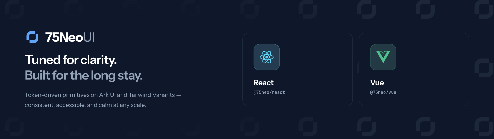

<picture>
  <source media="(prefers-color-scheme: dark)" srcset="assets/banner-dark.png">
  <source media="(prefers-color-scheme: light)" srcset="assets/banner-light.png">
  
</picture>

# 75NeoUI

A component library for React and Vue. Behaviour and accessibility come from
[Ark UI](https://ark-ui.com), styling from [Tailwind CSS](https://tailwindcss.com) and
[Tailwind Variants](https://www.tailwind-variants.org), and theming from a set of CSS
custom properties you can redefine.

Both adapters ship the same components with the same props, the same slot names and the
same variants.

| Framework | Package        | Requires            |
| --------- | -------------- | ------------------- |
| React     | `@75neo/react` | React 18 or greater |
| Vue       | `@75neo/vue`   | Vue 3.5 or greater  |

## Install

```sh
pnpm add @75neo/react   # or @75neo/vue
```

Either adapter pulls `@75neo/themes` in with it. Swap `pnpm add` for `npm install`,
`yarn add` or `bun add`.

Then add two imports to the stylesheet your app already loads:

```css
@import "tailwindcss";
@import "@75neo/themes";
```

That brings the tokens, the `light` and `dark` variants and the base layer. Dark mode is
a `.dark` class on a root element, so a theme toggle only has to move that class.

## Use a component

```tsx
import { Button } from "@75neo/react";

export function App() {
  return (
    <Button variant="solid" color="primary">
      Get started
    </Button>
  );
}
```

```vue
<script setup lang="ts">
import { Button } from "@75neo/vue";
</script>

<template>
  <Button variant="solid" color="primary">Get started</Button>
</template>
```

## Restyle it

Three entry points, from broadest to narrowest.

**Redefine a token** in your own CSS, after the import. Every value is a plain custom
property, and both themes flip with it:

```css
:root {
  --ui-radius: 0.5rem;
  --ui-primary: var(--color-teal-700);
}

.dark {
  --ui-primary: var(--color-teal-400);
}
```

Each semantic color is one token, spent at different strengths with Tailwind's opacity
modifier, so a rebrand is one line per color.

**Wrap a subtree in `Theme`** to restyle everything below it. Nesting composes:

```tsx
<Theme theme={{ button: { ui: { base: "rounded-full" }, props: { color: "neutral" } } }}>
  <Button>Rounded and neutral by default</Button>
</Theme>
```

**Pass `ui` to one component** to restyle that call alone. The keys are the component's
slots:

```tsx
<Button ui={{ base: "rounded-full", label: "tracking-wide" }}>One-off</Button>
```

All three settle through one cascade: the recipe, then `Theme` layers, then `ui`, then
`class` on the base slot. Tailwind-merge resolves conflicts, so a later layer replaces a
conflicting utility and everything else survives.
[`packages/themes/README.md`](packages/themes/README.md) has the token vocabulary.

## Documentation

- `pnpm dev:docs` runs the documentation site
- `pnpm dev:play` runs the playground, every component in React and Vue side by side

## Develop locally

```sh
mise install   # Node 24 and pnpm 11
pnpm install
pnpm build     # core → themes → react/vue
```

Before opening a pull request, run what CI runs:

```sh
pnpm format:check && pnpm lint && pnpm build && pnpm typecheck && pnpm test
```

The first `pnpm test` needs `pnpm exec playwright install --with-deps chromium`.

## Contributing

Open an issue with a minimal reproduction for a bug, or an issue or discussion for a
proposal.

> [!TIP]
> [`AGENTS.md`](AGENTS.md) carries the same guidelines in the form AI coding agents pick
> up automatically: commands, architecture, conventions and the checks to run.
