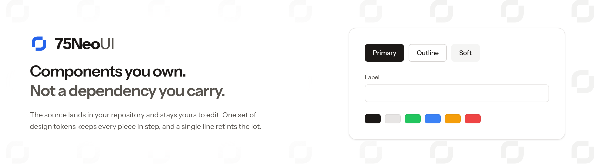

<picture>
  <source media="(prefers-color-scheme: dark)" srcset="assets/banner-dark.png">
  
</picture>

A component library for React and Vue, distributed as a [shadcn
registry](https://ui.shadcn.com/docs/registry/getting-started). You install a component's
source into your own project and own it from there; there is no runtime package to depend
on.

Components are written twice, once for each framework, over one shared
[tailwind-variants](https://www.tailwind-variants.org) recipe, so a button looks and
behaves the same whichever adapter you install.

## Requirements

Tailwind CSS v4 and a project the shadcn CLI recognises, which means a `components.json`
at its root. Run `npx shadcn@latest init` (or `npx shadcn-vue@latest init` for Vue) if you
do not have one.

## Install

Add the registry to your `components.json`:

```json
{
  "registries": {
    "@75neo": "https://75neo-ui.pages.dev/r/react/{name}.json"
  }
}
```

Vue projects point at the `vue` path instead:

```json
{
  "registries": {
    "@75neo": "https://75neo-ui.pages.dev/r/vue/{name}.json"
  }
}
```

Then add a component. React:

```sh
npx shadcn@latest add @75neo/button
```

Vue:

```sh
npx shadcn-vue@latest add @75neo/button
```

## Theme

Every component draws on a set of `--ui-*` custom properties and the Tailwind theme
mapping built on top of them. The `theme` item carries them, and the CLI installs it
automatically the first time you add a component. It writes `75neo-theme.css` to your
project root, which you import after Tailwind:

```css
@import "tailwindcss";
@import "./75neo-theme.css";
```

Dark mode is class-based: put `dark` on an ancestor of the components you want in the dark
palette. Retheme the library by overriding the `--ui-*` properties rather than the
Tailwind tokens derived from them.

Each of the six semantic intents carries a small ramp, a fill plus a hover step, a foreground, a
tint, a tint foreground and a border, so components express every state with a real colour rather
than an opacity. Neutrals are Tailwind's warm `stone` ramp and the default primary is near black.

## Working on the registry

```sh
pnpm install
pnpm dev              # docs site on http://localhost:4321
pnpm registry:build   # write the registry items into public/r
```

Component sources live under `registry/`: `react/ui` and `vue/ui` hold the adapters,
`shared/lib` the recipes both import, and `theme` the stylesheet. `registry.react.json`
and `registry.vue.json` list what each framework publishes. Imports between registry files
are written as `@/registry/…` because that is the prefix the shadcn CLI rewrites to the
installing project's own aliases.

`pnpm build` runs the registry build before Astro, so a deployment of the docs site is
also a publish of the registry.

## Working on the docs

Component pages fork by framework, at `/docs/components/react/<item>` and
`/docs/components/vue/<item>`, with a switch in the page header that remembers your choice.
The bare `/docs/components/<item>` path redirects to whichever you used last. Guides are shared.

Pages come from Markdown under `src/content`: `guides` for the getting started track and
`components` for one page per registry item. Component front matter carries a `registryItem`,
which is how a page finds its examples and its API reference. Code fences are filtered by
framework, so a `tsx` block only renders on React pages and a `vue` block only on Vue ones.

Examples live under `src/components/docs/demos/<item>`, with an `examples.ts` listing them in
order and one real source file per framework. The page renders that file and shows its source, so
the snippet a reader copies is the one that just ran. `pnpm registry:generate` writes a small
Astro wrapper next to each demo, which is how Astro gets the static import it needs to hydrate
them; those wrappers are generated and gitignored.

The API reference is not written by hand. A content collection loader reads the React
adapters with ts-morph and the Vue adapters with vue-component-meta, then renders props,
slots and events into the Table component. Add a prop to a component and the table follows
on the next build.
